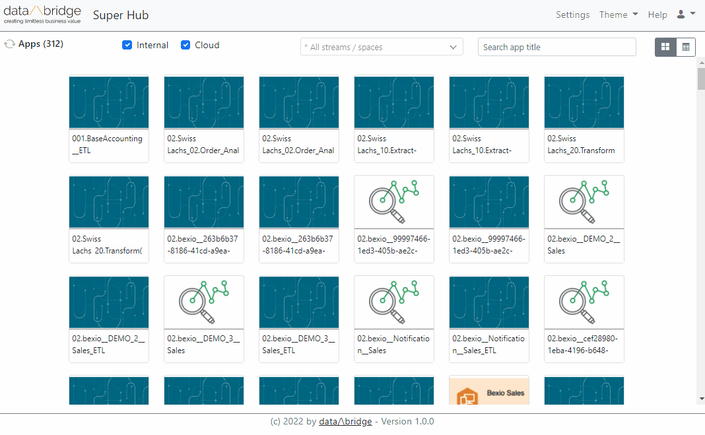

# data/\bridge Super Hub

Version history [here](./version-history.csv)

The data/\bridge Superhub is a very modern, Bootstrap 5 webpage that shows Qlik Sense apps from two environments in one place

- from Qlik Sense Windows server
- from Qlik Cloud tenant

You have a couple of filter possibilities, per environment (cloud/internal), based on streams/spaces, and a text search. You have an icon card view
and table view, as well as a light and a dark theme.

 
 
This version is free of charge and use-as-is. However, we are happy to add features per request and to upgrade to a supported version. Get in touch
with us at insight-sales@databridge.ch

# Links

- https://insight.databridge.ch/solutions

# Known limitations

- **Safari** doesn't send Qlik Cloud cookies because of a increased CORS security setting. To get it work on Safari
  go to Settings/Safari/Privacy & Security, turn off `Prevent Cross-Site Tracking`
